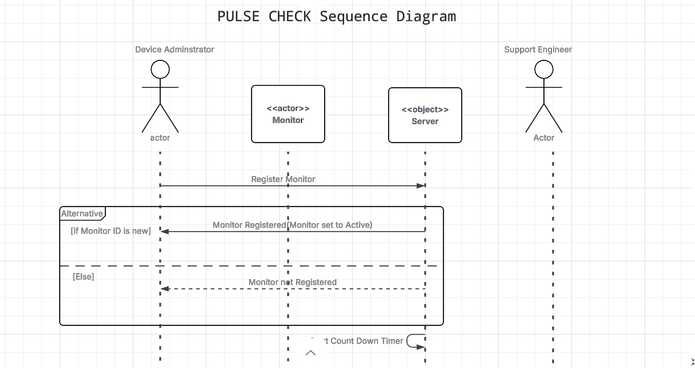
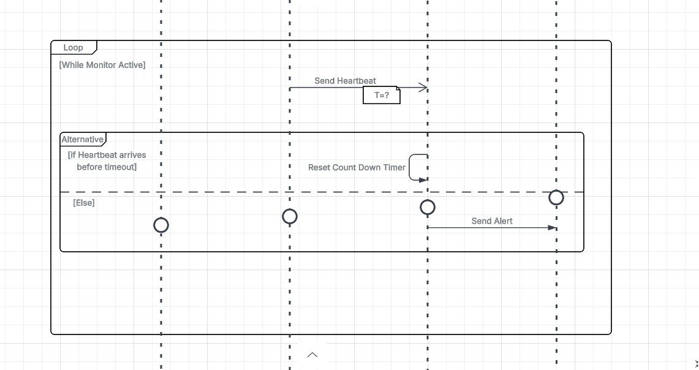

# Pulse-Check API — Watchdog Sentinel

[](https://github.com/Yvan-David/AmaliTech-DEG-Project-based-challenges/actions)


[](https://coveralls.io/github/Yvan-David/AmaliTech-DEG-Project-based-challenges?branch=main)

A **Dead Man's Switch API** for monitoring remote devices — solar farms, weather stations, unmanned infrastructure. Devices register a monitor with a countdown timer and must send periodic heartbeats to stay alive. If a device goes silent, the system automatically fires an alert email, logs the failure, and optionally hits a webhook.

**Live API:** https://amalitech-deg-project-based-challenges-v5cw.onrender.com/docs

Built with **FastAPI · Redis · Resend · Docker · GitHub Actions**.

---

## Table of Contents

- [Architecture](#architecture)
- [Tech Stack](#tech-stack)
- [Setup & Installation](#setup--installation)
- [Running with Docker](#running-with-docker)
- [Environment Variables](#environment-variables)
- [Running the Server](#running-the-server)
- [Running Tests](#running-tests)
- [CI/CD Pipeline](#cicd-pipeline)
- [API Documentation](#api-documentation)
- [Developer's Choice: Webhook Alerts](#developers-choice-webhook-alerts)
- [Design Decisions](#design-decisions)

---

## Architecture

### Sequence Diagram




> [View full diagram on Lucidchart](https://lucid.app/lucidchart/bf38fad2-3468-4840-ae97-09adff426742/edit?viewport_loc=271%2C539%2C1469%2C699%2C0_0&invitationId=inv_9ebd47d9-e2db-4c3e-8c42-a20c363821ad) *(login required)*

### Monitor State Machine

```
                    POST /monitors
                         │
                         ▼
                    ┌─────────┐
                    │ ACTIVE  │◄─────────────────────────────┐
                    └────┬────┘                              │
                         │                                   │
          ┌──────────────┼──────────────┐                    │
          │              │              │                    │
          ▼              ▼              │         POST /{id}/heartbeat
   timer expires   POST /pause         │         (also un-pauses PAUSED)
          │              │             │
          ▼              ▼             │
     ┌────────┐     ┌────────┐        │
     │  DOWN  │     │ PAUSED │────────┘
     └────┬───┘     └────────┘
          │
          │  POST /{id}/reset
          ▼
        ACTIVE  (config preserved, alert_count kept as history)
```

### Redis Key Schema

Two keys per monitor — data and timer are deliberately separate:

| Key | TTL | Purpose |
|-----|-----|---------|
| `monitor:{id}` | none | JSON blob — full monitor state, survives expiry |
| `monitor:{id}:timer` | `timeout` seconds | Countdown sentinel — its disappearance triggers the alert |

The data key carries no TTL so the watcher can read the device's email, webhook URL, and alert history even after the timer has already fired. Combining both into one key would delete all context the moment the device goes silent.

---

## Tech Stack

| Layer | Technology |
|-------|------------|
| Framework | FastAPI (Python 3.11) |
| Data store | Redis (TCP) |
| Email alerts | Resend |
| Background timer | Daemon thread polling Redis TTLs every second |
| Containerisation | Docker + Docker Compose |
| Testing | pytest · pytest-asyncio · fakeredis · coverage |
| Coverage reporting | Coveralls |
| CI/CD | GitHub Actions |
| Hosting | Render |

---

## Setup & Installation

### Prerequisites

- Python 3.11+
- Redis (local install, Docker, or a managed instance)
- A [Resend](https://resend.com) account (free tier is fine)

### Install dependencies

```bash
git clone https://github.com/Yvan-David/AmaliTech-DEG-Project-based-challenges.git
cd AmaliTech-DEG-Project-based-challenges/backend/Pulse-Check
python -m venv venv
source venv/bin/activate          # Windows: venv\Scripts\activate
pip install -r requirements.txt
```

---

## Running with Docker

The easiest way to run the full stack locally — no Redis install needed.

```bash
docker compose up --build
```

This starts two containers:

| Container | Role |
|-----------|------|
| `api` | FastAPI application on port 8000 |
| `redis` | Redis instance on port 6379 |

The API will be available at `http://localhost:8000`.

To stop:

```bash
docker compose down
```

---

## Environment Variables

Create a `.env` file in the project root:

```env
# Redis — TCP connection string
REDIS_URL=redis://localhost:6379/0

# Resend — from resend.com → API Keys
RESEND_API_KEY=re_xxxxxxxxxxxxxxxx
ALERT_FROM_EMAIL=alerts@yourdomain.com    # must be a verified sender in Resend
```

> **Never commit `.env` to version control.** It is listed in `.gitignore`.

On Render, set these under **Environment → Environment Variables** in the service dashboard. If `REDIS_URL` is not set, the application will refuse to start and log a clear error — it does not silently fall back to localhost.

---

## Running the Server

```bash
uvicorn app.main:app --reload
```

| URL | Description |
|-----|-------------|
| `http://localhost:8000` | API root — system overview |
| `http://localhost:8000/docs` | Swagger UI — interactive API reference |
| `http://localhost:8000/health` | Health check |

---

## Running Tests

Tests use `fakeredis` — no real Redis connection or credentials needed.

```bash
pytest
```

With coverage report:

```bash
pytest --cov=app --cov-report=term-missing
```

Generate an HTML coverage report:

```bash
pytest --cov=app --cov-report=html
open htmlcov/index.html
```

---

## CI/CD Pipeline

Every push and pull request to `main` triggers the GitHub Actions pipeline:

```
Push to main
     │
     ▼
┌─────────────────────────────┐
│  GitHub Actions CI          │
│  1. Install dependencies    │
│  2. Run pytest              │
│  3. Report coverage         │
│     to Coveralls            │
└─────────────┬───────────────┘
              │ on success
              ▼
        Render auto-deploys
        the latest main branch
```

The pipeline is defined in `.github/workflows/ci.yml`. No secrets beyond `COVERALLS_REPO_TOKEN` are required in CI — tests run entirely against `fakeredis`.

---

## API Documentation

### Base URL

```
https://amalitech-deg-project-based-challenges-v5cw.onrender.com/docs
```

---

### `GET /`

System overview — confirms the API is reachable and lists all endpoints.

**Response `200 OK`**
```json
{
  "system": "Pulse-Check API — Watchdog Sentinel",
  "description": "A Dead Man's Switch API for monitoring remote devices.",
  "version": "1.0.0",
  "status": "operational",
  "docs": "/docs",
  "endpoints": {
    "register_monitor": "POST   /monitors",
    "heartbeat":        "POST   /monitors/{id}/heartbeat",
    "pause":            "POST   /monitors/{id}/pause",
    "reset":            "POST   /monitors/{id}/reset",
    "get_monitor":      "GET    /monitors/{id}",
    "list_monitors":    "GET    /monitors",
    "delete_monitor":   "DELETE /monitors/{id}"
  }
}
```

---

### `GET /health`

Lightweight liveness check used by Render and monitoring tools.

**Response `200 OK`**
```json
{ "status": "ok" }
```

---

### `POST /monitors`

Register a new monitor and start its countdown timer.

Returns `409 Conflict` if the ID is already taken — the existing monitor's details are included in the response so you can make an informed decision before deleting it.

**Request Body**
```json
{
  "id": "device-123",
  "timeout": 60,
  "alert_email": "admin@critmon.com",
  "webhook_url": "https://hooks.example.com/alert"
}
```

| Field | Type | Required | Description |
|-------|------|----------|-------------|
| `id` | string | ✅ | Unique device identifier |
| `timeout` | integer > 0 | ✅ | Countdown duration in seconds |
| `alert_email` | string (email) | ✅ | Address to alert when the device goes down |
| `webhook_url` | string (URL) | ❌ | Optional endpoint to POST the alert payload to |

**Response `201 Created`**
```json
{
  "message": "Monitor registered. Countdown started.",
  "monitor_id": "device-123",
  "status": "active",
  "expires_at": "2025-06-23T18:50:00Z"
}
```

**Response `409 Conflict` — ID already active or paused**
```json
{
  "detail": {
    "error": "Monitor 'device-123' is already registered.",
    "hint": "Use a different ID, or DELETE this monitor first.",
    "existing_monitor": {
      "id": "device-123",
      "status": "active",
      "alert_email": "admin@critmon.com",
      "webhook_url": null,
      "timeout": 60,
      "created_at": "2025-06-23T18:49:00Z",
      "alert_count": 0
    }
  }
}
```

**Response `409 Conflict` — ID exists but is down**
```json
{
  "detail": {
    "error": "Monitor 'device-123' exists but is currently down.",
    "hint": "Call POST /monitors/device-123/reset to recover it without losing its history.",
    "existing_monitor": {
      "id": "device-123",
      "status": "down",
      "alert_count": 2,
      "alert_email": "admin@critmon.com"
    }
  }
}
```

---

### `POST /monitors/{id}/heartbeat`

Reset the countdown timer. Also un-pauses a paused monitor automatically.

**Response `200 OK`**
```json
{
  "message": "Heartbeat received. Timer reset.",
  "monitor_id": "device-123",
  "status": "active",
  "expires_at": "2025-06-23T18:51:00Z"
}
```

| Status | Condition |
|--------|-----------|
| `404 Not Found` | Monitor ID does not exist |
| `409 Conflict` | Monitor is down — call `/reset` first |

---

### `POST /monitors/{id}/pause`

Freeze the countdown. No alert will fire while paused. Send a heartbeat to resume automatically.

**Response `200 OK`**
```json
{
  "message": "Monitor paused. No alerts will fire until next heartbeat.",
  "monitor_id": "device-123",
  "status": "paused",
  "expires_at": "2025-06-23T18:50:00Z"
}
```

| Status | Condition |
|--------|-----------|
| `404 Not Found` | Monitor ID does not exist |

---

### `POST /monitors/{id}/reset`

Recover a downed monitor without deleting and re-registering it. Restarts the countdown and sets status back to `active`. All configuration (email, webhook, timeout) is preserved. `alert_count` is kept as a historical record.

Only valid when the monitor status is `down`.

**Response `200 OK`**
```json
{
  "message": "Monitor recovered. Countdown restarted. Awaiting first heartbeat.",
  "monitor_id": "device-123",
  "status": "active",
  "expires_at": "2025-06-23T19:00:00Z"
}
```

| Status | Condition |
|--------|-----------|
| `404 Not Found` | Monitor ID does not exist |
| `409 Conflict` | Monitor is not down (already active or paused) |

---

### `GET /monitors/{id}`

Fetch the current state of a monitor, including live seconds remaining on the countdown.

**Response `200 OK`**
```json
{
  "id": "device-123",
  "timeout": 60,
  "alert_email": "admin@critmon.com",
  "webhook_url": null,
  "status": "active",
  "created_at": "2025-06-23T18:49:00Z",
  "expires_at": "2025-06-23T18:50:00Z",
  "last_heartbeat": "2025-06-23T18:49:30Z",
  "alert_count": 0,
  "seconds_remaining": 30
}
```

| Status | Condition |
|--------|-----------|
| `404 Not Found` | Monitor ID does not exist |

---

### `GET /monitors`

List all registered monitors.

**Response `200 OK`**
```json
[
  { "id": "device-123", "status": "active", "alert_count": 0, "..." : "..." },
  { "id": "device-456", "status": "paused", "alert_count": 1, "..." : "..." }
]
```

---

### `DELETE /monitors/{id}`

Permanently remove a monitor and cancel its countdown. Reserved for decommissioning a device — not for recovering from downtime (use `/reset` for that).

**Response `204 No Content`**

| Status | Condition |
|--------|-----------|
| `404 Not Found` | Monitor ID does not exist |

---

### Alert Payload

When a device goes down, this payload is logged to the console and sent via email (and webhook if configured):

```json
{
  "ALERT": "Device device-123 is down!",
  "time": "Monday, 23 Jun 2025 at 8:50 PM",
  "alert_email": "admin@critmon.com",
  "alert_count": 1
}
```

Time is displayed in **Central Africa Time (CAT, UTC+2)** — Rwanda local time.

---

## Developer's Choice: Webhook Alerts

**Feature:** An optional `webhook_url` field on monitor registration.

**Why:** Email alerts are reliable but passive — an engineer must check their inbox. A webhook delivers the alert payload via HTTP POST in real time to any endpoint: a Slack bot, a PagerDuty integration, a mobile push service, or a custom dashboard. This makes the alerting system extensible without coupling it to any specific notification platform.

**How it works:**

Register a monitor with a `webhook_url`:
```json
{
  "id": "solar-farm-7",
  "timeout": 3600,
  "alert_email": "ops@critmon.com",
  "webhook_url": "https://hooks.slack.com/services/xxx/yyy/zzz"
}
```

When the timer expires, the watcher fires both the email **and** a POST to the webhook URL with the same alert payload. If webhook delivery fails (network error, 4xx/5xx response), it is logged as an error and does not block the email or crash the watcher loop.

---

## Design Decisions

**Why `/reset` instead of re-registering to recover a downed monitor?**
A monitor going down is an incident, not a reason to lose its configuration or history. `/reset` recovers the device in one call, preserves `alert_count` as a maintenance signal (how many times has this device gone down?), and makes recovery an explicit, auditable action rather than a silent re-registration.

**Why does `POST /monitors` return 409 instead of silently replacing?**
Accidental ID reuse would silently overwrite a running monitor's email, webhook, and timeout — a hard-to-debug production incident. Returning 409 with the existing monitor's full details forces the caller to make a conscious decision: is this a duplicate, or did I mean a different ID?

**Why polling instead of Redis keyspace notifications?**
Keyspace notifications require `notify-keyspace-events` to be enabled server-side — disabled by default on most managed Redis services. A 1-second polling loop works everywhere, requires zero server configuration, and is negligible in CPU cost.

**Why two Redis keys per monitor?**
The data key (`monitor:{id}`) has no TTL so monitor state survives expiry. The timer key (`monitor:{id}:timer`) is a sentinel whose sole job is to disappear on schedule. Merging them would delete all context — email address, webhook URL, alert history — at the exact moment it's most needed.

**Why Resend over smtplib?**
No SMTP server, port config, or TLS management. One API key, one function call, and it works on Render out of the box. Failed sends are caught and logged without crashing the watcher thread.

**Why fakeredis for tests?**
Tests run offline in CI with no credentials required. `fakeredis` mirrors the full Redis API including TTL behaviour, so `RedisStore` needs zero changes to work under test.

**Why Docker?**
Eliminates "works on my machine" — a single `docker compose up` gives any developer a running API and Redis instance with no local installation beyond Docker itself.